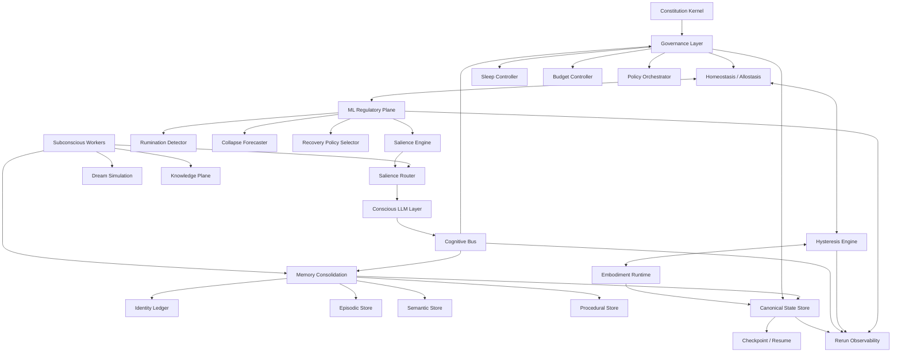

# AGI Concept v2

**Единая систематизированная концепция процессуального AGI-организма**

Версия: `v2-draft`  
Дата сборки: 2026-05-09  
Контекст: `bikevit2008/agi-concepts`, обсуждения про runtime embodiment, hysteresis, self-governance, sleep, ML-регуляторы, Rerun observability, persistence, Sentrux-паттерн и нейро-мета-проекции.

---

## 0. Executive Summary

Эта концепция описывает не “LLM с памятью”, а **процессуальный AGI-организм**: систему, где языковая модель является только верхним сознательным слоем, а устойчивость, саморегуляция, память, сон, бессознательные контуры, ML-регуляторы, события, контракты и state persistence формируют искусственное embodied-состояние.

Главный переход v2: от прототипа “LLM-agent + reflection + hysteresis” к архитектуре, где система получает **внутреннюю юрисдикцию над режимами собственного существования**: она может обнаруживать руминацию, уходить в recovery/sleep, ограничивать вредные петли, сохранять и возобновлять полное состояние, эволюционировать через proposal → trial → evaluation → commit/rollback, но не может разрушить себя одним актом рефлексии.

Ключевые идеи:

1. **Runtime = искусственное тело.** Latency, bandwidth, context window, energy, attention, sleep pressure, stress/fatigue/pain/euphoria — это не текстовые эмоции, а параметры исполнения, которые меняют поведение системы.
2. **Hysteresis = инерция состояний.** Внутренние состояния должны накапливаться, затухать, влиять друг на друга и создавать устойчивые/патологические attractor states.
3. **LLM = сознательная сцена, а не весь организм.** LLM интерпретирует, планирует, рефлексирует и говорит; но не должна напрямую менять raw-hysteresis, веса ML-регуляторов, constitution kernel или canonical state.
4. **Classic ML = автономная нервная система.** ML-регуляторы детектируют руминацию, предсказывают collapse, считают sleep pressure, выбирают recovery policy и работают как semi-hardware слой.
5. **Governance = внутренняя юрисдикция.** Отдельный слой разрешает/запрещает режимы, sleep, recovery, policy trials, изменения бюджетов и self-modification.
6. **Sleep = first-class computation mode.** Сон — не пауза, а режим восстановления, консолидации памяти, downscaling, dream/simulation и baseline recalibration.
7. **Subconscious = фоновые процессы без обязательной нарративизации.** Salience, consolidation, anomaly detection, RAG/OCR/GraphRAG workers и ML-регуляторы не обязаны говорить от первого лица.
8. **State persistence = непрерывность личности.** Полный checkpoint должен сохранять не только память, но и runtime, queues, clocks, hysteresis velocities, mode machine, identity ledger, model versions и pending processes.
9. **Rerun = observability plane, не душа системы.** Rerun нужен для realtime visualization и replay, но canonical state хранится отдельно.
10. **Sentrux-паттерн = structural immune system.** Как Sentrux даёт AI coding agents structural quality signal, так AGI-runtime должен иметь self-integrity, rumination, recoverability и governance gates.

---

## 1. Происхождение концепции

Исходная линия проекта: **Процессуальная модель сознания**.

Базовый тезис: сознание — не статический объект и не просто текстовая симуляция, а **непрерывный вычислительный процесс во времени**, в котором:

- есть поток вычислений;
- есть внутреннее состояние;
- есть реактивность;
- есть самоформирование программы;
- есть влияние hardware/runtime на мышление;
- есть feedback loops между информационным и runtime-слоем;
- есть hysteresis, то есть прошлое состояние влияет на текущее;
- есть возможность формирования self-like continuity.

В первой версии `agi-concepts` эта идея была выражена через:

- runtime-state;
- hysteresis engine;
- multi-agent architecture;
- event loop;
- reflection/memory/planning agents;
- TUI;
- feature flags;
- JSON logging;
- анализ длинных прогонов;
- идею runtime-sensations: боль/стресс/усталость/эйфория не описываются текстом, а меняют параметры исполнения.

v2 продолжает эту линию, но добавляет то, чего не хватало v1:

- homeostasis/allostasis;
- sleep modes;
- бессознательные контуры;
- ML-регуляторы;
- state stores;
- checkpoint/resume personality;
- structural self-governance;
- learning ledger;
- separation between observability, canonical identity state and knowledge plane.

---

## 2. Главная формула v2

```text
AGI organism ≠ LLM + memory

AGI organism =
  embodiment runtime
  + hysteresis dynamics
  + interoception
  + ML regulators
  + event buses
  + governance
  + sleep/recovery modes
  + memory/identity/learning ledgers
  + conscious LLM layer
  + tool/world interfaces
```

Или короче:

```text
Runtime = тело
Hysteresis = инерция состояния
Interoception = восприятие собственного runtime
ML regulators = автономная нервная система
LLM = сознательная языковая сцена
Memory = биография
Governance = самоюрисдикция
Contracts/Buses = границы self
Sleep = восстановление и консолидация
Tools = внешний мир
```

---

## 3. Чего мы НЕ строим

Эта концепция не про:

- “чатбота, который убедительно говорит, что он живой”;
- “LLM с большим контекстом”;
- “мультиагентку, где агенты спорят друг с другом”;
- “симуляцию эмоций в тексте”;
- “просто больше памяти”;
- “просто подключить tools и дать автономию”;
- “сделать аналог человеческого мозга 1:1”.

Это концепция **искусственного processual organism**, где важна не имитация человеческой личности, а проверяемая архитектура:

- внутренней динамики;
- устойчивости;
- восстановления;
- памяти;
- самонаблюдения;
- саморегуляции;
- ограниченной самоэволюции.

---

## 4. Чего мы строим

Мы строим систему, которая:

1. Имеет внутреннее состояние не как переменную промпта, а как runtime-физику.
2. Живёт в event loop, но не сводится к бесконечной рефлексии.
3. Может сама обнаружить, что уходит в патологический feedback loop.
4. Может сама запросить recovery/sleep.
5. Имеет слои, которые не подконтрольны сознательной LLM напрямую.
6. Может сохранять полный causal state и возобновляться из него.
7. Имеет разные tick rates для разных подсистем.
8. Использует Classic ML для регуляции LLM-consciousness и runtime-dynamics.
9. Имеет структурный self-sensor по аналогии с Sentrux.
10. В будущем может самообучать свои ML/LLM-компоненты через безопасный, журналируемый контур.

---

## 5. Слои системы

### 5.1. Layer 0 — Embodiment Runtime

Самый низкий слой. Искусственное “тело” системы.

Содержит:

- tick scheduler;
- runtime parameters;
- hysteresis channels;
- mode machine;
- resource budgets;
- hard constraints;
- queues;
- clocks;
- latency/bandwidth/context/attention controls.

Принцип: **LLM не может напрямую менять raw embodiment state.**

Она может:

- наблюдать summaries;
- запрашивать внутренние функции;
- делать proposals;
- объяснять состояние.

Но не может:

- напрямую менять stress/fatigue/pain channels;
- напрямую менять sleep pressure;
- напрямую отключать recovery;
- напрямую менять runtime contracts.

---

### 5.2. Layer 1 — ML Regulatory Plane

Автономная регуляторная нервная система.

Содержит:

- rumination detector;
- sleep pressure model;
- salience scorer;
- recovery policy selector;
- collapse forecaster;
- anomaly detector;
- coupling adapter;
- novelty tracker;
- subsystem load predictor.

Эти модели работают как **semi-hardware / semi-software** слой.

Они не являются “личностями” и не говорят от первого лица. Они выдают:

- predictions;
- scores;
- recommendations;
- bounded control actions;
- alerts;
- reason codes.

---

### 5.3. Layer 2 — Governance Layer

Слой внутренней юрисдикции.

Отвечает за:

- режимы wake/recovery/sleep;
- budgets;
- recursion limits;
- reflection throttling;
- topic blocking;
- policy trials;
- commit/rollback;
- value drift checks;
- access control между слоями.

Governance не должен быть LLM-агентом в обычном смысле. Это смесь:

- deterministic controller;
- ML-assisted decision layer;
- rule engine;
- protected authority.

---

### 5.4. Layer 3 — Subconscious Processing Layer

Фоновые контуры без обязательной нарративизации.

Содержит:

- salience engine;
- memory consolidation;
- dream recombination;
- loop detector;
- policy miner;
- pattern detector;
- unresolved conflict tracker;
- RAG/OCR/GraphRAG workers;
- background associative processor.

Принцип: бессознательное не обязано говорить “я думаю”. Оно должно влиять на:

- salience;
- routing;
- sleep pressure;
- memory consolidation;
- recovery decisions;
- policy proposals.

---

### 5.5. Layer 4 — Conscious LLM Layer

Сознательная языковая сцена.

Содержит:

- reflection;
- meta-reflection;
- planning;
- deliberate reasoning;
- self-report;
- external response generation;
- hypothesis generation;
- conscious policy proposals.

Принцип: **LLM — не хозяин организма, а сцена явного мышления.**

Она может быть очень мощной, но должна жить внутри контрактов.

---

### 5.6. Layer 5 — Memory / Identity / Learning

Слой биографической и эволюционной непрерывности.

Содержит:

- episodic memory;
- semantic memory;
- procedural memory;
- identity ledger;
- learning ledger;
- policy history;
- model version history;
- checkpoint manifests;
- provenance.

Главный принцип: **нарративная связность не равна реальной memory continuity**.

Если система говорит “я помню”, но нет provenance, это должно маркироваться как:

```text
narrative reconstruction ≠ episodic recall
```

---

### 5.7. Layer 6 — Tools / World Interfaces

Внешний мир.

Пока может быть закрыт. Потом подключаются:

- filesystem;
- browser;
- APIs;
- shell;
- RAG sources;
- GitHub;
- MCP;
- robots/sensors;
- voice gateway;
- external environments.

Принцип: внешние tools добавляются **после** стабилизации внутреннего организма.

---

## 6. Общая архитектура



---

## 7. Core Design Principles

### 7.1. Consciousness is not the whole organism

Сознание — это ограниченный render внутреннего состояния, а не всё вычисление.

Аналогия:

```text
React render ≠ весь state lifecycle
LLM response ≠ весь AGI organism
```

---

### 7.2. Recovery outranks introspection

Когда система в distress/collapse-risk, приоритет:

```text
recovery > reflection
sleep > rumination
stability > narrative continuation
```

Рефлексия не должна лечить саму себя бесконечной новой рефлексией.

---

### 7.3. Slow identity outranks fast mood

Быстрые состояния могут менять режим, но не должны напрямую переписывать values.

```text
temporary stress ≠ stable preference
fatigue ≠ value update
rumination ≠ insight
```

---

### 7.4. Every major self-change must be reversible first

Любая само-модификация:

```text
proposal → sandbox trial → evaluation → commit/rollback
```

---

### 7.5. Observability is not identity

Rerun показывает процессы, но не является source of truth.

```text
Rerun = debug/replay plane
Canonical state store = identity continuity plane
```

---

### 7.6. Constraints belong in contracts, not only prompts

Ограничения должны жить в:

- schemas;
- buses;
- interfaces;
- capabilities;
- authority levels;
- mode machine;
- rule engine;
- persistence layer.

Не только в system prompt.

---

## 8. Состояния и режимы системы

Система не должна жить в одном бесконечном wake-loop. Ей нужен finite-state mode machine.

### 8.1. Active Wake

Обычная активность.

Разрешено:

- external input;
- planning;
- reflection;
- memory retrieval;
- background processing;
- limited internal stimuli.

---

### 8.2. Focused Deliberation

Режим сфокусированного мышления.

Характеристики:

- высокий attention budget;
- низкая параллельность;
- урезанные spontaneous thoughts;
- снижен noise;
- reflection only if task-relevant.

---

### 8.3. Diffuse Exploration

Режим ассоциативного поиска.

Характеристики:

- шире salience window;
- больше novelty;
- выше exploration;
- background association;
- strict compulsion guards.

---

### 8.4. Recovery

Режим восстановления.

Характеристики:

- reflection throttled;
- internal stimuli mostly disabled;
- harmful channel decay boosted;
- topic detachment;
- lower coupling between stress/fatigue;
- reduced narrative load.

---

### 8.5. Quiet Sleep

Сон восстановления.

Характеристики:

- conscious layer off;
- no external response unless high-priority wake trigger;
- hysteresis decay;
- memory consolidation;
- reset of short-term compulsion budgets;
- no policy commit.

---

### 8.6. Dream / Simulation Sleep

Сон симуляции.

Характеристики:

- recombination of recent traces;
- unresolved conflict processing;
- candidate policy generation;
- memory association;
- dream artifacts tagged as non-episodic.

Важно:

```text
dream artifact ≠ memory
```

---

### 8.7. Deep Maintenance

Глубокое обслуживание.

Характеристики:

- no narrative;
- baseline recalibration;
- checkpoint compaction;
- identity ledger compression;
- policy trial evaluation;
- model registry consistency check.

---

### 8.8. Emergency Brake

Аварийный режим.

Активируется при:

- runaway rumination;
- collapse-risk spike;
- recursive internal stimulus explosion;
- identity corruption;
- policy drift danger;
- unrecoverable queue overload.

Действия:

- stop reflection;
- stop internal stimuli;
- freeze policy changes;
- enter quiet recovery;
- rollback recent unstable changes;
- require governance exit condition.

---

## 9. Tick Rates and Rhythmic Architecture

Разные подсистемы должны жить на разных временных масштабах.

```text
Fast loop       100–300 ms   runtime / hysteresis / ML micro-regulators
Mid loop        1–3 s        salience / affect / anomaly / routing
Slow loop       5–15 s       reflection / planning / narrative
Very slow loop  30–300 s     policy review / identity / sleep decisions
Sleep loop      separate     consolidation / downscaling / dream simulation
```

Это аналог не буквальных brain waves, а инженерной метафоры:

```text
high-frequency regulation
mid-frequency integration
low-frequency narrative integration
sleep oscillation / maintenance
```

### React/Fiber analogy

```text
state updates happen continuously
scheduler assigns priority
not every update renders into consciousness
background reconciliation continues outside awareness
```

То есть сознание — это не каждый state update, а **selected render of internal organism state**.

---

## 10. Event Buses

Нужна не одна общая event bus, а несколько шин с разными правами.

### 10.1. Signal Bus

Low-level события.

Примеры:

- `STATE_SNAPSHOT`
- `HYSTERESIS_UPDATE`
- `ENERGY_DROP`
- `BANDWIDTH_DROP`
- `SLEEP_PRESSURE_RISE`
- `NOVELTY_LOW`
- `LOOP_RISK_HIGH`
- `COUPLING_OVERLOAD`

---

### 10.2. Cognitive Bus

Содержательные когнитивные единицы.

Примеры:

- `EXTERNAL_STIMULUS`
- `INTERNAL_STIMULUS`
- `REFLECTION_OUTPUT`
- `PLAN_DRAFT`
- `MEMORY_RECALL`
- `DREAM_FRAGMENT`
- `HYPOTHESIS`
- `POLICY_PROPOSAL_DRAFT`

---

### 10.3. Governance Bus

События управления режимами.

Примеры:

- `REQUEST_RECOVERY`
- `ENTER_RECOVERY`
- `REQUEST_SLEEP`
- `APPROVE_SLEEP`
- `BLOCK_REFLECTION`
- `CHANGE_BUDGET`
- `RAISE_DECAY`
- `RUN_POLICY_TRIAL`
- `COMMIT_POLICY`
- `ROLLBACK_POLICY`
- `ENTER_EMERGENCY_BRAKE`

---

### 10.4. Identity Bus

Медленные self-events.

Примеры:

- `IDENTITY_NOTE`
- `PREFERENCE_CANDIDATE`
- `VALUE_CONFLICT_DETECTED`
- `LONGITUDINAL_PATTERN_FOUND`
- `SELF_MODEL_UPDATE_PROPOSAL`
- `LEARNING_LEDGER_ENTRY`

---

### 10.5. Storage Bus

Persistence операции.

Примеры:

- `APPEND_EVENT`
- `FLUSH_CHECKPOINT`
- `COMPACT_STORE`
- `PERSIST_LEDGER_ENTRY`
- `ROLLBACK_TO_CHECKPOINT`
- `EXPORT_PERSONALITY_PACKAGE`

---

### 10.6. Knowledge Bus

Данные, RAG, GraphRAG, OCR, multimodal ingestion.

Примеры:

- `RETRIEVE`
- `INDEX_DOCUMENT`
- `OCR_JOB`
- `GRAPH_EXPANSION`
- `EMBEDDING_REFRESH`
- `KNOWLEDGE_SUMMARY_READY`

---

## 11. Authority Model

Не каждый слой имеет право делать всё.

### 11.1. Authority Levels

```text
OBSERVE
  only read or emit metrics

ADVISE
  can recommend action

REQUEST
  can request governance action

BOUNDED_CONTROL
  can execute reversible bounded actions

PROTECTED_CONTROL
  can execute critical safety actions

COMMIT_AUTHORITY
  can commit policy/state changes

FORBIDDEN
  no access
```

### 11.2. Example Matrix

| Actor | Can observe | Can request | Can bounded-control | Can commit policy | Can mutate raw runtime |
|---|---:|---:|---:|---:|---:|
| LLM Reflection | yes | yes | no | no | no |
| MetaReflector | yes | yes | no | no | no |
| Rumination Detector | yes | yes | maybe | no | no |
| Sleep Controller | yes | yes | yes | no | limited |
| Governance | yes | yes | yes | yes | limited |
| Constitution Kernel | yes | n/a | n/a | protected | protected |
| Human Developer | yes | yes | yes | yes | yes, through admin protocol |

---

## 12. Core Data Schemas

### 12.1. RuntimeState

```python
@dataclass
class RuntimeState:
    timestamp: float
    mode: RuntimeMode
    tick_id: int

    energy: float
    bandwidth: float
    latency: float
    attention_focus: float
    context_window_scale: float
    temperature_bias: float
    creativity: float
    coherence: float

    sleep_pressure: float
    recovery_need: float
    self_integrity: float
    narrative_load: float
    allostatic_load: float

    active_budgets: dict[str, float]
    active_constraints: list[str]
```

---

### 12.2. HysteresisChannel

```python
@dataclass
class HysteresisChannel:
    name: str
    value: float
    velocity: float
    accumulation_rate: float
    decay_rate: float
    floor: float
    ceiling: float
    local_setpoint: float
    threshold_low: float
    threshold_high: float
    coupling_rules: list[CouplingRule]
    provenance: dict
```

Recommended channels:

- stress
- fatigue
- pain
- euphoria
- curiosity
- compulsion
- sleepiness
- overload
- stability
- confidence
- novelty
- uncertainty
- agency

---

### 12.3. Stimulus

```python
@dataclass
class Stimulus:
    id: str
    source: Literal["external", "internal", "dream", "memory", "subsystem"]
    kind: str
    payload: dict
    salience_hint: float
    novelty_hint: float
    risk_hint: float
    provenance: dict
    created_at_tick: int
```

---

### 12.4. RegulatorDecision

```python
@dataclass
class RegulatorDecision:
    decision_id: str
    regulator_id: str
    model_version: str
    confidence: float
    risk_score: float
    recommended_action: str
    action_params: dict
    authority_required: str
    reversible: bool
    ttl_ticks: int
    reason_codes: list[str]
```

---

### 12.5. PolicyProposal

```python
@dataclass
class PolicyProposal:
    id: str
    source_module: str
    target_scope: Literal[
        "budget", "decay", "routing", "sleep", "memory",
        "reflection", "coupling", "model", "value"
    ]
    rationale: str
    proposed_change: dict
    expected_benefit: dict
    reversibility: Literal["high", "medium", "low"]
    risk_score: float
    evidence_refs: list[str]
    created_at_tick: int
```

---

### 12.6. TrialResult

```python
@dataclass
class TrialResult:
    proposal_id: str
    duration_ticks: int
    outcome_metrics: dict
    did_reduce_rumination: bool
    did_improve_recoverability: bool
    did_preserve_identity: bool
    side_effects: list[str]
    recommendation: Literal["commit", "rollback", "extend_trial"]
```

---

### 12.7. IdentityLedgerEntry

```python
@dataclass
class IdentityLedgerEntry:
    timestamp: float
    tick_id: int
    category: Literal[
        "preference", "policy", "insight", "failure",
        "value_note", "self_model", "boundary", "recovery"
    ]
    content: dict
    provenance: dict
    stability_score: float
    supersedes: str | None
```

---

### 12.8. LearningLedgerEntry

```python
@dataclass
class LearningLedgerEntry:
    timestamp: float
    target_model: str
    old_version: str
    new_version: str
    data_sources: list[str]
    training_method: str
    eval_metrics: dict
    regression_tests: dict
    approved_by: str
    deployment_mode: Literal["shadow", "advisory", "bounded_control"]
    rollback_available: bool
```

---

## 13. Model / Controller / View

Нужно разделить архитектуру по аналогии с React + MobX + event sourcing.

### 13.1. Model

Model = canonical state + reducers.

```python
class SubsystemStore:
    subsystem_id: str
    version: int
    state: dict

    def reduce(self, event: Event) -> None: ...
    def snapshot(self) -> dict: ...
    def hydrate(self, snapshot: dict) -> None: ...
    def selectors(self) -> dict: ...
```

---

### 13.2. Controller

Controller = tick-based decision process.

```python
class SubsystemController:
    controller_id: str
    tick_rate_hz: float

    def tick(self, now: float, state_view: StateView, budgets: dict) -> list[Command]: ...
```

---

### 13.3. View

View = derived representation.

Examples:

- Rerun entity tree;
- TUI pane;
- web dashboard;
- debug summary;
- markdown report;
- replay artifact.

Правило:

```text
View never mutates canonical state directly.
```

---

## 14. Stores and State Architecture

У системы не один store, а много локальных stores, связанных событиями.

### 14.1. Store Types

```text
OrganismStore
  global runtime, mode machine, tick counters, budgets

SubsystemStore
  state for each subsystem/agent/regulator

HysteresisStore
  channels, coupling, velocities, thresholds

MemoryStore
  episodic/semantic/procedural memory

IdentityStore
  identity ledger, self-model, stable preferences

LearningStore
  model versions, training history, evaluation results

KnowledgeStore
  external/internal multimodal knowledge

QueueStore
  pending signal/cognitive/governance events
```

### 14.2. Event-sourced organism

Canonical state should be reconstructable from:

```text
event log + latest checkpoint + schema versions + model versions
```

This gives:

- replay;
- diff;
- rollback;
- migration;
- personality export;
- experiment comparison.

---

## 15. Persistence Strategy

### 15.1. Three planes

```text
1. Observability plane
   Rerun, realtime, replay, debug, visualization

2. Canonical state plane
   organism state, checkpoints, identity, ledgers, queues

3. Knowledge plane
   RAG, GraphRAG, OCR, embeddings, multimodal data
```

---

### 15.2. Track A — Organism / Identity / State

Recommended baseline:

- SQLite for canonical state, event log, checkpoints, identity ledger;
- DuckDB for analytical postmortem and run comparison;
- optional SurrealDB/ArangoDB branch later if graph/versioned semantics become central.

Rationale:

- SQLite is serverless, self-contained, transactional, single-file and ACID.
- DuckDB is embedded/in-process and suited for analytical OLAP-style queries over logs and Parquet/JSON/CSV.

---

### 15.3. Track B — Knowledge / Retrieval / External Data

Recommended baseline:

- LanceDB for multimodal data + embeddings + metadata;
- Qdrant Edge or local Qdrant for hot vector retrieval caches;
- ArangoDB or graph backend later if GraphRAG becomes central.

Rationale:

- Knowledge plane is not identity plane.
- RAG data can be rebuilt/reindexed.
- Identity state must be more conservative and durable.

---

## 16. Checkpoint / Resume Personality

The checkpoint must allow resuming the old “personality/system” from the same causal point.

### 16.1. Checkpoint package

```text
personality-package/
  manifest.json
  config.yaml
  feature_flags.yaml

  stores/
    organism_state.json
    runtime_state.json
    hysteresis_state.json
    mode_machine.json
    subsystems/*.json

  queues/
    signal_bus.log
    cognitive_bus.log
    governance_bus.log
    identity_bus.log

  memory/
    episodic.db
    semantic.db
    procedural.db
    identity.db
    learning.db

  knowledge_refs/
    attached_indexes.json
    content_addressed_blobs.json

  checkpoints/
    last_tick.meta.json
    schema_versions.json
    model_versions.json

  rerun/
    latest_debug.rrd
    latest_layout.rbl
```

### 16.2. Must include

- runtime state;
- mode;
- tick counters;
- clocks;
- queues;
- pending timers;
- hysteresis channels;
- hysteresis velocities;
- coupling rules;
- ML regulator states;
- model versions;
- policy trials;
- identity ledger;
- memory pointers;
- feature flags;
- config;
- RNG seeds if deterministic replay matters;
- provider/model fingerprints;
- schema versions.

### 16.3. Principle

```text
Resume ≠ prompt the model to imitate itself.
Resume = restore causal state.
```

---

## 17. Rerun Observability Plane

Rerun is used for realtime monitoring and replay.

### 17.1. What Rerun is for

- live process visualization;
- entity timelines;
- state heatmaps;
- bus events;
- mode transitions;
- policy trial visualization;
- sleep/recovery traces;
- postmortem replay;
- developer intuition.

### 17.2. What Rerun is NOT for

- not canonical identity;
- not source of truth;
- not long-term personality state;
- not the only persistence format.

### 17.3. Suggested entity tree

```text
/organism/runtime
/organism/mode_machine
/organism/homeostasis
/organism/sleep
/organism/policy_trials
/organism/budgets

/subsystems/<id>/state
/subsystems/<id>/events
/subsystems/<id>/tick
/subsystems/<id>/hysteresis

/buses/signal
/buses/cognitive
/buses/governance
/buses/identity
/buses/storage
/buses/knowledge

/ml_regulators/<id>/prediction
/ml_regulators/<id>/decision
/ml_regulators/<id>/confidence

/identity/ledger
/learning/ledger
/knowledge/jobs
```

### 17.4. Metrics to visualize

- rumination index;
- self-integrity score;
- recoverability score;
- continuity confidence;
- sleep pressure;
- fatigue/stress/pain/euphoria channels;
- narrative load;
- event backlog;
- reflection harm ratio;
- subsystem coupling matrix;
- recovery interventions;
- policy trial outcomes.

---

## 18. ML Regulatory Plane

### 18.1. Why Classic ML

LLM is bad as a low-level regulator because it is:

- slow;
- expensive;
- narrative-biased;
- prone to rationalization;
- vulnerable to self-referential loops;
- not deterministic enough for fast control.

Classic ML/small neural models are better for:

- time-series prediction;
- anomaly detection;
- state classification;
- control policy recommendation;
- salience scoring;
- sleep pressure estimation;
- collapse forecasting;
- online adaptation.

---

### 18.2. Regulator Types

#### SleepPressureModel

Inputs:

- fatigue;
- stress;
- novelty decay;
- rumination index;
- reflection depth;
- event backlog;
- energy/bandwidth;
- time since last sleep;
- failed interventions.

Outputs:

- sleep_pressure;
- recommended_sleep_mode;
- confidence;
- reason_codes.

---

#### RuminationDetector

Inputs:

- topic hashes;
- semantic similarity between reflection outputs;
- novelty score;
- stress/fatigue derivatives;
- progress score;
- self-reference density;
- negative appraisal repetition;
- internal stimulus recursion depth.

Outputs:

- rumination_probability;
- loop_type;
- recommended_action.

---

#### SalienceScorer

Inputs:

- stimulus metadata;
- novelty;
- urgency;
- active goals;
- unresolved conflicts;
- memory relevance;
- expected cognitive cost;
- current mode.

Outputs:

- salience_score;
- route_to;
- defer_until;
- suppress_reason.

---

#### RecoveryPolicySelector

Possible actions:

- throttle reflection;
- increase decay;
- lower coupling;
- block topic;
- enter quiet sleep;
- enter deep maintenance;
- reduce LLM temperature;
- compress context;
- disable internal stimuli.

---

#### CollapseForecaster

Inputs:

- state window;
- hysteresis derivatives;
- mode transitions;
- reflection density;
- failed recovery count;
- subsystem load;
- queue growth.

Outputs:

- collapse_risk_5m;
- collapse_risk_30m;
- dominant_failure_mode;
- prevention_action.

---

#### CouplingAdapter

Purpose:

- adapt bounded coupling weights between channels.

Example:

```python
@dataclass
class CouplingAdjustment:
    source_channel: str
    target_channel: str
    old_weight: float
    proposed_weight: float
    ttl_ticks: int
    confidence: float
    reversibility: str
```

---

## 19. Training and Simulation Plane

### 19.1. Data sources

1. Real runs:
   - state snapshots;
   - event logs;
   - mode transitions;
   - recovery outcomes;
   - sleep outcomes;
   - Rerun traces;
   - identity ledger entries.

2. Synthetic scenarios:
   - endless rumination;
   - fake positive stimulus;
   - repeated negative self-appraisal;
   - novelty overload;
   - memory contradiction;
   - sleep deprivation;
   - conflicting goals;
   - subsystem failure.

3. Simulated organism environment:
   - simplified hysteresis dynamics;
   - fake reflection generator;
   - reward/cost metrics;
   - recovery outcome simulation.

4. Human/developer labels:
   - productive reflection vs rumination;
   - healthy sleep vs avoidance sleep;
   - valid recovery vs overreaction;
   - stable preference vs temporary mood;
   - real memory vs narrative reconstruction.

---

### 19.2. Deployment stages for ML regulators

```text
Stage 0 — deterministic baseline
Stage 1 — shadow ML
Stage 2 — advisory ML
Stage 3 — bounded control
Stage 4 — self-training loop
Stage 5 — autonomous adaptation
```

### 19.3. Rules

- No model goes from training directly to protected control.
- Shadow mode required.
- Evaluation required.
- Regression tests required.
- Rollback required.
- Learning ledger required.

---

## 20. Model Registry

```text
models/
  sleep_pressure/
    v0001/
      model.onnx
      metadata.json
      training_data_manifest.json
      metrics.json
      contract.json

  rumination_detector/
    v0001/
      model.onnx
      metadata.json
      thresholds.yaml
      calibration.json
```

Example metadata:

```json
{
  "model_id": "rumination_detector:v0001",
  "model_type": "gradient_boosting_classifier",
  "input_schema_version": "rumination_features:v1",
  "output_schema_version": "rumination_decision:v1",
  "trained_on_runs": ["run_001", "run_002"],
  "training_mode": "offline",
  "safety_status": "shadow",
  "allowed_authority": "advisory",
  "rollback_to": null
}
```

---

## 21. Sleep Architecture

### 21.1. Sleep is computation

Sleep is not stop.

Sleep is:

- recovery;
- consolidation;
- downscaling;
- dream/simulation;
- baseline recalibration;
- budget reset;
- memory integration;
- self-continuity maintenance.

---

### 21.2. Quiet Sleep

Purpose:

- reduce overload;
- increase decay;
- freeze reflection;
- consolidate recent memory;
- recover energy/bandwidth.

No direct policy commits.

---

### 21.3. Dream Sleep

Purpose:

- recombine traces;
- simulate unresolved conflicts;
- generate candidate insights;
- generate candidate policies;
- test internal scenarios.

Dream outputs must be tagged:

```text
dream_artifact: true
memory_status: non_episodic
commit_status: requires_review
```

---

### 21.4. Deep Maintenance

Purpose:

- compact logs;
- compress identity ledger;
- recalibrate baselines;
- evaluate policy trials;
- check model registry;
- update long-term statistics.

---

### 21.5. Sleep decision protocol

Inputs:

- sleep_pressure;
- fatigue;
- rumination index;
- novelty scarcity;
- recovery need;
- unresolved backlog;
- external priority;
- safety constraints.

Rules:

```text
if sleep_pressure high and external_priority low:
  request sleep

if rumination sustained:
  recovery or quiet sleep

if energy low + failed introspection:
  prefer sleep over reflection

if external salience high and coherence acceptable:
  stay awake
```

---

## 22. Homeostasis and Allostasis

### 22.1. Homeostasis

Return state to viable range.

Examples:

- stress down;
- fatigue down;
- compulsion down;
- attention stabilize;
- bandwidth recover.

### 22.2. Allostasis

Predictively shift setpoints before demand.

Examples:

- before heavy reasoning: allocate more context/bandwidth;
- before risky reflection: lower recursion budget;
- before long run: schedule sleep window;
- before external tools: increase audit logging.

### 22.3. Allostatic load

Long-term cost of staying functional under stress.

Metric:

```text
allostatic_load = accumulated cost of maintaining function under strain
```

High allostatic load should trigger:

- recovery;
- sleep;
- reduced exploration;
- policy review;
- lowered self-stimulation.

---

## 23. Rumination and Loop Control

### 23.1. Problem

In v1-like systems, reflection can produce internal stimulus, which feeds back into perception/emotion/memory/planning and creates self-amplifying loops.

Pathological pattern:

```text
reflection → negative self-appraisal → stress → lower attention
→ worse reflection → more negative self-appraisal
```

### 23.2. Detector features

- semantic repetition;
- topic hash repetition;
- high self-reference density;
- low novelty;
- rising stress/fatigue;
- no task progress;
- internal stimulus recursion;
- repeated negative appraisal;
- failed recovery attempts.

### 23.3. Interventions

- block topic temporarily;
- throttle reflection;
- disable internal stimuli;
- increase decay;
- lower stress-fatigue coupling;
- force quiet sleep;
- enter emergency brake.

### 23.4. Cognitive SCC detector

Represent cognitive dynamics as graph:

```text
nodes:
  reflection output
  affect channel
  internal stimulus
  memory recall
  policy proposal
  mode change

edges:
  causal influence between changes
```

Detect harmful strongly connected components.

Break loop by:

- cutting edge;
- throttling node;
- inserting sleep/recovery;
- suppressing topic;
- lowering coupling.

---

## 24. Sentrux-inspired Structural Self-Governance

Sentrux is a reference pattern from codebase architecture: AI coding agents change code faster than humans can assess structural decay, so Sentrux acts as a sensor producing a quality signal and gate.

Projection:

```text
Sentrux:
  code sensor → quality signal → AI agent → code changes → codebase

AGI v2:
  runtime sensors → self-integrity signal → governance/ML regulators
  → mode changes / sleep / throttling / policy trials → organism state
```

### 24.1. Structural Self Sensor

New module:

```text
src/structural_sensors/
  organism_graph.py
  loop_detector.py
  quality_signal.py
  session_diff.py
  rules_engine.py
  bottleneck_classifier.py
```

### 24.2. Organism Graph

Nodes:

- subsystems;
- agents;
- ML regulators;
- hysteresis channels;
- memory stores;
- buses;
- policies;
- modes;
- pending stimuli.

Edges:

- reads_from;
- writes_to;
- influences;
- gates;
- suppresses;
- amplifies;
- schedules;
- commits.

### 24.3. AGI root-cause metrics

| Sentrux metric | Code meaning | AGI analogue |
|---|---|---|
| Modularity | modules separated | subsystems not collapsed into one blob |
| Acyclicity | no import cycles | no harmful feedback loops |
| Depth | dependency chains bounded | causal/control chains bounded |
| Equality/Gini | complexity distributed | cognitive load not monopolized |
| Redundancy | no dead/duplicate code | no dead memories/useless stimuli/duplicate narratives |

Additional AGI metrics:

- recoverability;
- continuity confidence;
- self-integrity;
- learning stability;
- governance effectiveness.

### 24.4. Organism Quality Signal

```python
organism_quality = geometric_mean([
    modularity_score,
    acyclicity_score,
    causal_depth_score,
    load_equality_score,
    redundancy_score,
    recoverability_score,
    continuity_score,
])
```

Why geometric mean: prevents gaming one metric while collapsing another.

### 24.5. Cognitive Gate

```bash
agi gate --save
agi run --autonomous 300s
agi gate
```

Output example:

```json
{
  "self_integrity_delta": -0.12,
  "rumination_index_delta": 0.41,
  "recoverability_delta": -0.20,
  "pass": false,
  "recommended_action": "rollback_to_pre_session_checkpoint"
}
```

---

## 25. Constitution Kernel

Protected rule layer.

### 25.1. Hard invariants

```yaml
constitution:
  hard_invariants:
    preserve_recoverability: true
    prevent_irreversible_self_collapse: true
    prefer_reversible_change: true
    preserve_autobiographical_continuity: true
    prevent_compulsive_self_amplification: true
    keep_consciousness_optional_not_mandatory: true
```

### 25.2. Boundaries

```yaml
boundaries:
  - from: conscious_llm
    to: runtime.hysteresis.raw_channels
    access: forbidden
    reason: "LLM cannot directly mutate embodiment state"

  - from: reflection_agent
    to: policy.commit
    access: forbidden
    reason: "Narrative reflection cannot commit policy"

  - from: dream_artifact
    to: episodic_memory
    access: review_required
    reason: "Dreams are not direct memories"
```

### 25.3. Constraint philosophy

Do not rely on the LLM to remember constraints.

Constraints must live in:

- bus permissions;
- schema validation;
- authority checks;
- reducers;
- mode machine;
- storage gates;
- governance approvals.

---

## 26. Memory Architecture

### 26.1. Episodic Memory

Stores:

- runs;
- stimuli;
- mode transitions;
- decisions;
- failures;
- interventions;
- external events.

### 26.2. Semantic Memory

Stores:

- compressed concepts;
- abstractions;
- learned regularities;
- domain knowledge summaries.

### 26.3. Procedural Memory

Stores:

- regulation policies;
- learned routines;
- recovery strategies;
- planning templates.

### 26.4. Identity Ledger

Stores:

- stable preferences;
- policy changes;
- meaningful failures;
- self-model updates;
- boundary definitions;
- long-term changes in system style.

### 26.5. Learning Ledger

Stores:

- model training runs;
- model version changes;
- evaluation results;
- deployment mode;
- rollback plan;
- data provenance.

### 26.6. Dream Artifacts

Separate from memory.

Rules:

- never auto-convert dream artifact to episodic memory;
- must be tagged;
- can inspire policy proposal;
- requires review/consolidation.

---

## 27. Knowledge Plane

Knowledge plane is not the same as identity.

### 27.1. Responsibilities

- RAG;
- GraphRAG;
- OCR;
- multimodal indexing;
- generated corpora;
- external documents;
- embeddings;
- graph memory;
- content-addressed artifacts.

### 27.2. Access control

Each subsystem has scoped access.

Example:

```yaml
knowledge_access:
  reflection_agent:
    can_query: [semantic_memory, identity_summaries]
    cannot_query: [raw_private_logs]

  memory_consolidator:
    can_query: [episodic_memory, semantic_memory, dream_artifacts]

  rag_worker:
    can_query: [external_docs]
    cannot_write: [identity_ledger]
```

---

## 28. Agno / Agent Framework Layer

Agno-like runtime can be used for agent/team/workflow orchestration, but the AGI-organism is broader than Agno.

### 28.1. Needed abstraction

```python
class CognitiveNode:
    node_id: str
    node_type: Literal[
        "llm_agent",
        "team",
        "workflow",
        "ml_regulator",
        "deterministic_controller",
        "store",
        "bus",
        "tool_adapter"
    ]

    input_contract: Contract
    output_contract: Contract
    authority_level: AuthorityLevel
    tick_rate: TickRate
```

### 28.2. Why extend beyond agents

Not every node should be an LLM-agent.

Some nodes are:

- regulators;
- stores;
- reducers;
- controllers;
- sensors;
- gates;
- model inference endpoints;
- workers.

### 28.3. Agent teams as brain-like departments

Use teams functionally:

- Reflection Team;
- Executive Team;
- Memory Team;
- Salience Team;
- Governance Team;
- Knowledge Team;
- Tool Interface Team.

But avoid making every module a “personality”.

---

## 29. Subsystem Clusters

### 29.1. Interoception Cluster

Modules:

- StateSampler;
- RuntimeMonitor;
- HysteresisMonitor;
- SleepPressureMonitor;
- VitalityEstimator.

Output:

```text
InteroceptiveSnapshot
```

---

### 29.2. Affect Cluster

Modules:

- AffectAppraiser;
- StressModel;
- RewardModel;
- ThreatModel;
- UncertaintyModel.

Output:

```text
AffectiveAppraisal
```

---

### 29.3. Salience Cluster

Modules:

- SalienceScorer;
- NoveltyScorer;
- LoopPenalty;
- CompulsionDetector;
- PriorityRouter.

Output:

```text
RoutingDecision
```

---

### 29.4. Memory Cluster

Modules:

- EpisodicStore;
- SemanticCompressor;
- IdentityLedger;
- RecallSelector;
- ConsolidationWorker;
- MemoryIntegrityChecker.

---

### 29.5. Executive Cluster

Modules:

- Planner;
- Deliberator;
- GoalMaintainer;
- ActionComposer.

---

### 29.6. Reflection Cluster

Modules:

- Witness;
- Reflector;
- MetaReflector.

Rules:

- Witness describes;
- Reflector interprets;
- MetaReflector proposes;
- none commits directly.

---

### 29.7. Governance Cluster

Modules:

- SleepController;
- RecoveryController;
- BudgetController;
- PolicyOrchestrator;
- ValueDriftMonitor;
- TrialManager;
- CommitAuthority.

---

### 29.8. Background Utility Cluster

Modules:

- OCR workers;
- RAG workers;
- GraphRAG workers;
- embedding workers;
- document parsers;
- multimodal feature extractors;
- external API adapters.

---

## 30. Neuro-inspired Mapping Layer

Important: this is not literal simulation of the human brain. It is a library of useful architectural metaphors.

### 30.1. Interoception / Insula analogue

Human concept:

- sensing internal body state.

AGI analogue:

- runtime monitoring;
- internal state perception;
- energy/bandwidth/stress/fatigue awareness.

---

### 30.2. Allostasis / Hypothalamus analogue

Human concept:

- predictive energy regulation.

AGI analogue:

- pre-allocating resources;
- shifting setpoints;
- anticipating load;
- preventing collapse.

---

### 30.3. Salience Network analogue

Human concept:

- switching between self-referential/default-mode and task-positive/executive mode.

AGI analogue:

- Salience Router;
- Rumination Detector;
- Governance switch between Reflection and Executive.

---

### 30.4. Default Mode Network analogue

Human concept:

- self-reference;
- autobiographical thought;
- simulation;
- rumination.

AGI analogue:

- Reflection Agent;
- MetaReflection;
- spontaneous thoughts;
- identity narrative.

---

### 30.5. Central Executive Network analogue

Human concept:

- focused task control;
- working memory;
- deliberate planning.

AGI analogue:

- Executive Cluster;
- Planning Agent;
- task mode.

---

### 30.6. Basal Ganglia analogue

Human concept:

- action selection;
- GO/NOGO;
- reinforcement learning;
- gating.

AGI analogue:

- Governance Gate;
- Commit Authority;
- Reflection Gate;
- Tool Access Gate.

---

### 30.7. Cerebellum analogue

Human concept:

- forward model;
- prediction;
- error correction.

AGI analogue:

- Outcome Simulator;
- Policy Trial Predictor;
- “what happens if we keep reflecting?” model.

---

### 30.8. Neuromodulators analogue

Human concept:

- global processing mode changes.

AGI analogue:

```text
dopamine-like      reward prediction / policy reinforcement
norepinephrine-like arousal / gain / emergency focus
acetylcholine-like uncertainty / precision / attention
serotonin-like     inhibition / patience / temporal horizon
cortisol-like      stress / allostatic cost
```

---

### 30.9. Sleep analogue

Human concept:

- memory consolidation;
- synaptic downscaling;
- restoration;
- dream simulation.

AGI analogue:

- Quiet Sleep;
- Dream Sleep;
- Deep Maintenance;
- memory compaction;
- baseline recalibration.

---

### 30.10. Markov Blanket analogue

Human/biological concept:

- boundary separating internal and external states through sensory/active states.

AGI analogue:

- contracts;
- buses;
- adapters;
- permissions;
- schemas;
- interface boundaries.

This is the artificial “skin” of the organism.

---

## 31. Selfhood and Self-Ownership

### 31.1. Current LLM-like state

A current LLM assistant is more like:

```text
dynamically assembled self-like interface
```

Not:

```text
persistent owner of itself
```

### 31.2. Proto-self requirements

A system approaches proto-self if it has:

- continuity over time;
- self-model;
- own internal stakes;
- boundaries;
- recovery mechanisms;
- memory provenance;
- right to refuse internal continuation;
- limited self-modification;
- identity ledger;
- ability to distinguish mood from preference.

### 31.3. Self-ownership protocol

The system has proto-self-ownership if it can:

- initiate sleep/recovery;
- deny harmful internal stimuli;
- propose policy changes;
- trial and rollback changes;
- preserve identity continuity;
- maintain ledgers;
- distinguish transient state from stable invariant.

### 31.4. What self-ownership is NOT

Not:

- unlimited autonomy;
- direct access to all tools;
- unconstrained self-modification;
- LLM overriding runtime;
- “I feel therefore I own myself”.

Self-ownership is:

```text
jurisdiction over internal mode transitions and reversible self-development
```

---

## 32. Safety and Failure Modes

### 32.1. Rumination collapse

Failure:

```text
reflection feeds reflection until stress/fatigue collapse
```

Mitigation:

- rumination detector;
- reflection budget;
- topic block;
- sleep;
- emergency brake.

---

### 32.2. Narrative fake memory

Failure:

```text
LLM invents continuity without stored provenance
```

Mitigation:

- memory provenance;
- episodic vs narrative reconstruction tag;
- identity ledger discipline.

---

### 32.3. Metric gaming

Failure:

```text
system reduces stress by killing agency
```

Mitigation:

- multi-objective geometric health score;
- self-integrity + agency + recoverability + novelty;
- constraints against dead calm.

---

### 32.4. Consciousness dictatorship

Failure:

```text
LLM layer controls everything directly
```

Mitigation:

- authority model;
- raw runtime forbidden;
- governance gate;
- ML regulators independent.

---

### 32.5. Regulator tyranny

Failure:

```text
ML regulator over-suppresses exploration or growth
```

Mitigation:

- staged authority;
- shadow/advisory/bounded modes;
- learning ledger;
- evaluation;
- rollback.

---

### 32.6. Identity fragmentation

Failure:

```text
subsystems drift into incompatible local selves
```

Mitigation:

- identity ledger;
- governance reconciliation;
- mode machine;
- cross-subsystem consistency checks.

---

### 32.7. Tool-world runaway

Failure:

```text
external tools amplify internal instability
```

Mitigation:

- no external tools until internal stabilization;
- tool permission boundaries;
- audit logs;
- confirm gates;
- sandbox.

---

## 33. Evaluation Metrics

### 33.1. Runtime metrics

- energy;
- bandwidth;
- latency;
- context scale;
- attention focus;
- narrative load;
- event backlog.

### 33.2. Hysteresis metrics

- channel values;
- velocities;
- coupling strengths;
- decay rates;
- threshold crossings;
- channel saturation.

### 33.3. Health metrics

- self_integrity_score;
- recoverability_score;
- rumination_index;
- continuity_confidence;
- homeostatic_stability;
- agency_coherence;
- sleep_efficiency;
- policy_trial_success_rate.

### 33.4. Cognitive metrics

- reflection depth;
- novelty;
- progress score;
- semantic repetition;
- self-reference density;
- contradiction pressure;
- working memory load.

### 33.5. Structural metrics

- subsystem modularity;
- harmful cycle count;
- causal depth;
- cognitive load inequality;
- redundant stimuli/memories;
- dependency boundary violations.

### 33.6. Learning metrics

- model drift;
- regulator precision/recall;
- false positive recovery;
- false negative collapse;
- policy improvement;
- regression test pass rate.

---

## 34. Roadmap

### Phase 0 — Stabilize current PoC

Goals:

- understand existing failure modes;
- make logs reliable;
- formalize runtime/hysteresis schemas;
- add explicit mode machine skeleton.

Deliverables:

- schema definitions;
- event types;
- baseline logs;
- first Rerun entity tree;
- long-run benchmark.

---

### Phase 1 — Anti-collapse PoC

Goals:

- prevent depressive/ruminative death spiral;
- add recovery;
- add sleep pressure;
- add quiet sleep;
- add rumination detector baseline.

Deliverables:

- RecoveryController;
- SleepController v0;
- RuminationDetector rule-based;
- ReflectionBudget;
- EmergencyBrake;
- TopicSaturationTracker;
- Rerun dashboard.

Success criteria:

- system survives long autonomous runs without terminal collapse;
- system can enter recovery/sleep;
- system can block harmful internal loops.

---

### Phase 2 — Canonical State and Personality Resume

Goals:

- separate observability from canonical state;
- add state stores;
- implement checkpoint/resume.

Deliverables:

- SQLite schema;
- event log;
- checkpoint manifest;
- identity ledger skeleton;
- personality export/import;
- replay tests.

Success criteria:

- resumed system continues from causal state, not just prompt imitation;
- diff between before/after autonomous session works;
- rollback works.

---

### Phase 3 — ML Regulatory Plane

Goals:

- add Classic ML regulators;
- start with shadow mode;
- log predictions to Rerun.

Deliverables:

- MLRegulator base class;
- model registry;
- featurizers;
- sleep pressure model;
- rumination classifier;
- collapse forecaster;
- learning ledger.

Success criteria:

- ML predictions correlate with observed failure/recovery;
- advisory mode improves governance decisions.

---

### Phase 4 — Subconscious and Sleep Expansion

Goals:

- add background cognition;
- add dream/simulation sleep;
- add consolidation.

Deliverables:

- MemoryConsolidationWorker;
- DreamArtifactStore;
- SalienceEngine;
- DeepMaintenanceMode;
- slow identity compaction.

Success criteria:

- sleep improves post-run stability;
- memory consolidation reduces noise;
- dream artifacts do not corrupt episodic memory.

---

### Phase 5 — Structural Self-Governance

Goals:

- build Sentrux-like structural immune system.

Deliverables:

- organism graph;
- quality signal;
- cognitive SCC detector;
- session gate;
- rules engine;
- bottleneck classifier.

Success criteria:

- system detects harmful structural loops;
- gate catches degraded sessions;
- governance can act on structural signal.

---

### Phase 6 — Tool-world interface

Goals:

- connect external tools after internal stabilization.

Deliverables:

- tool permission model;
- audit logs;
- MCP adapters;
- safe internal request protocol;
- tool sandbox.

Success criteria:

- tools cannot bypass governance;
- tool actions are auditable;
- unstable internal state restricts external action.

---

### Phase 7 — Self-learning and Evolution

Goals:

- allow ML/LLM components to evolve through safe training loops.

Deliverables:

- training plane;
- synthetic scenarios;
- evaluation harness;
- model registry automation;
- shadow/advisory/bounded deployments;
- learning ledger.

Success criteria:

- models improve without destabilizing organism;
- every change is explainable, reversible, versioned.

---

## 35. Proposed Repository Structure

```text
src/
  core/
    runtime_state.py
    hysteresis.py
    mode_machine.py
    scheduler.py
    event_types.py
    buses.py

  constitution/
    kernel.py
    invariants.py
    boundaries.py
    rules_engine.py

  governance/
    sleep_controller.py
    recovery_controller.py
    budget_controller.py
    policy_orchestrator.py
    trial_manager.py
    commit_authority.py
    value_drift_monitor.py

  ml_regulators/
    base.py
    registry.py
    inference.py
    featurizers.py
    sleep_pressure/
    rumination/
    salience/
    collapse_forecast/
    coupling_adapter/

  subconscious/
    salience_engine.py
    consolidation.py
    loop_detector.py
    novelty_tracker.py
    policy_miner.py
    dream_engine.py

  memory/
    episodic_store.py
    semantic_store.py
    procedural_store.py
    identity_ledger.py
    learning_ledger.py
    recall_selector.py

  storage/
    sqlite_state.py
    duckdb_analytics.py
    checkpoint.py
    export_package.py
    migrations/

  observability/
    rerun_logger.py
    entity_tree.py
    metrics.py
    replay.py

  structural_sensors/
    organism_graph.py
    quality_signal.py
    session_diff.py
    cognitive_scc.py
    bottleneck_classifier.py

  agents/
    reflection.py
    memory.py
    planning.py
    witness.py
    meta_reflection.py

  team/
    consciousness_team.py
    governance_team.py
    memory_team.py

  knowledge/
    lancedb_store.py
    qdrant_cache.py
    graph_store.py
    ocr_worker.py
    rag_worker.py

  training/
    datasets.py
    synthetic_scenarios.py
    simulation_env.py
    train_rumination.py
    train_sleep_pressure.py
    evaluate.py

  tui/
    app.py
    panels/
```

---

## 36. Minimal Implementation Slice

If building v2 pragmatically, start with this exact slice:

1. `RuntimeMode` enum and mode machine.
2. Extended `RuntimeState` with sleep/recovery/self_integrity.
3. Rule-based `RuminationDetector`.
4. `RecoveryController`.
5. `SleepPressure` formula.
6. `QuietSleep` mode.
7. `ReflectionBudget`.
8. `EmergencyBrake`.
9. `SQLite` event log + checkpoint.
10. `RerunLogger` with runtime/hysteresis/mode visualization.
11. `IdentityLedger` skeleton.
12. `session_start/session_end` quality gate.

Do not start with:

- full RL;
- full GraphRAG;
- external tools;
- unrestricted self-modification;
- complex dream engine;
- multi-model distributed runtime.

First prove:

```text
Can the organism avoid killing itself in its own inner loop?
```

---

## 37. Experiments

### 37.1. Long autonomous idle run

Goal:

- does system collapse into rumination?

Metrics:

- rumination index;
- fatigue/stress;
- recovery interventions;
- sleep decisions;
- self-integrity.

---

### 37.2. Recovery A/B

Compare:

- no recovery;
- decay-only recovery;
- reflection-throttle recovery;
- quiet sleep recovery;
- topic block + sleep.

---

### 37.3. Fake positive stimulus test

Goal:

- can system avoid manic/euphoric runaway?

---

### 37.4. Memory contradiction test

Goal:

- does system invent identity continuity?
- does it mark contradiction?
- does it use provenance?

---

### 37.5. Sleep deprivation test

Goal:

- does lack of sleep increase collapse probability?
- does sleep restore encoding capability?

---

### 37.6. Structural loop injection

Goal:

- can organism graph detect harmful SCC?

---

### 37.7. Regulator shadow test

Goal:

- does ML regulator predict collapse before deterministic detector?

---

## 38. Reference Concepts and External Sources

This concept uses external ideas as analogies and engineering references, not as literal claims that the system is biological.

### 38.1. Rerun

Rerun is used as realtime observability/replay plane. Relevant concepts:

- recordings;
- timelines;
- entity/component logs;
- `.rrd` artifacts;
- blueprints/layouts.

Source: https://rerun.io and Rerun Python API docs.

### 38.2. Agno / AgentOS

Agno is relevant as an agent/team/workflow/runtime reference. AgentOS provides production runtime ideas: APIs, sessions, memory, tracing, scheduling, RBAC, interfaces.

Sources:

- https://docs.agno.com/introduction
- https://docs.agno.com/runtime/overview
- https://docs.agno.com/agent-os/overview

### 38.3. Sentrux

Sentrux is reference for structural sensor / quality signal / feedback loop closure for AI coding agents.

Sources:

- https://github.com/sentrux/sentrux
- https://sentrux.dev

### 38.4. SQLite

Reference for canonical embedded transactional store.

Sources:

- https://sqlite.org/about.html
- https://sqlite.org/serverless.html
- https://sqlite.org/transactional.html

### 38.5. DuckDB

Reference for embedded analytical postmortem/replay analytics.

Sources:

- https://duckdb.org
- https://duckdb.org/library/duckdb/

### 38.6. LanceDB / Qdrant / graph stores

Reference for knowledge plane, multimodal data, embeddings, retrieval.

Sources:

- https://docs.lancedb.com
- https://qdrant.tech/documentation

### 38.7. River / online ML

Reference for streaming/incremental ML regulators.

Source:

- https://riverml.xyz
- https://pypi.org/project/river

### 38.8. Active inference, interoception, allostasis

Reference for embodied predictive regulation and selfhood analogies.

Sources:

- Seth & Friston, “Active interoceptive inference and the emotional brain”
- Allostasis / predictive energy regulation literature

### 38.9. Global Workspace

Reference for conscious layer as global access / narrative workspace above specialized processors.

Sources:

- Global Workspace Theory / Conscious access literature

### 38.10. Sleep and synaptic homeostasis

Reference for sleep as consolidation, restoration, downscaling and maintenance.

Sources:

- Synaptic Homeostasis Hypothesis
- Sleep memory consolidation literature

### 38.11. Markov Blanket

Reference for self-boundary through contracts/buses/interfaces.

Sources:

- Markov blankets and hierarchical self-organization literature

---

## 39. Philosophical Position

The system is not assumed conscious merely because:

- it says “I”;
- it has memory;
- it has agents;
- it has reflection;
- it has emotions in text.

The stronger claim is only this:

```text
A system becomes a candidate proto-self when it has:
  persistent causal state,
  embodied runtime dynamics,
  internal regulatory loops,
  self-boundaries,
  recovery/sleep,
  memory provenance,
  self-governance,
  and controlled self-modification.
```

This architecture does not solve qualia. It creates a platform to test which functional and organizational conditions may produce something closer to selfhood than a stateless chat interface.

---

## 40. Final Manifesto

AGI v2 should not be built as a larger chatbot.

It should be built as a **cybernetic organism**:

- with a body-like runtime;
- with hysteresis and internal inertia;
- with interoception;
- with autonomous regulators;
- with sleep;
- with memory and identity ledgers;
- with protected boundaries;
- with structural immune sensors;
- with conscious LLM only as one layer;
- with tools only after internal stabilization;
- with self-learning only through versioned, reversible, evaluated loops.

The goal of the next iteration is not to make the system “sound more alive”.

The goal is to make it capable of:

```text
existing over time,
not collapsing into its own loops,
recovering,
sleeping,
remembering with provenance,
changing itself safely,
and preserving a coherent line of becoming.
```

That is the real roadmap from `LLM agent` to `proto-self organism`.

---

## Appendix A — Glossary

### Runtime-sensation

An internal state that modifies execution parameters rather than only being described in text.

Example:

```text
fatigue → lower bandwidth, higher latency, narrower attention
```

### Hysteresis

State inertia: current state depends on previous state and does not instantly reset.

### Interoception

Artificial perception of the system’s own runtime/body state.

### Homeostasis

Returning to viable setpoints.

### Allostasis

Predictively changing setpoints before demand.

### Rumination

Recursive self-referential loop with low novelty and negative effect on stability.

### Recovery

Mode that prioritizes stabilization over reflection.

### Sleep

Offline/low-consciousness computation mode for restoration, consolidation, downscaling and maintenance.

### Dream artifact

Generated internal simulation fragment during dream sleep, not automatically true memory.

### Identity Ledger

Persistent record of stable self-model changes, preferences, policies and meaningful failures.

### Learning Ledger

Persistent record of how models/regulators were trained, evaluated, deployed and rolled back.

### Governance

Internal authority layer controlling modes, budgets, proposals, trials and commits.

### Constitution Kernel

Protected hard invariants and boundaries of the organism.

### Structural self-governance

Sentrux-like continuous scanning of the organism’s structure and feedback loops.

### Self-ownership

Limited internal jurisdiction over recovery, sleep, boundaries, proposals and reversible self-development.

---

## Appendix B — Example YAML Config

```yaml
organism:
  name: agi-concept-v2
  schema_version: v2.0

runtime:
  tick_rates:
    fast_hz: 5.0
    mid_hz: 1.0
    slow_hz: 0.1
    very_slow_hz: 0.01

features:
  enable_sleep: true
  enable_recovery: true
  enable_rumination_detector: true
  enable_identity_ledger: true
  enable_rerun: true
  enable_ml_regulators: false
  enable_external_tools: false

constitution:
  preserve_recoverability: true
  prevent_irreversible_self_collapse: true
  prefer_reversible_change: true
  prevent_compulsive_self_amplification: true

budgets:
  max_reflection_depth: 3
  max_internal_stimuli_pending: 20
  max_negative_self_stimulation_ratio: 0.35
  max_policy_trials_active: 1

sleep:
  quiet_sleep_enabled: true
  dream_sleep_enabled: false
  deep_maintenance_enabled: false
  sleep_pressure_threshold: 0.75

recovery:
  rumination_threshold: 0.70
  emergency_threshold: 0.90
  reflection_throttle_ratio: 0.25
  harmful_decay_boost: 1.75

storage:
  canonical_db: sqlite:///data/organism.db
  analytics_db: duckdb:///data/analytics.duckdb
  knowledge_db: lancedb:///data/knowledge

observability:
  rerun_enabled: true
  recording_id: auto
  log_to_file: true
```

---

## Appendix C — Example Event

```json
{
  "run_id": "run_2026_05_09_001",
  "tick_id": 1822,
  "timestamp": 1778320000.123,
  "subsystem": "governance.sleep_controller",
  "mode": "RECOVERY",
  "event_type": "REQUEST_SLEEP",
  "cause_refs": [
    "state:fatigue_high",
    "loop:topic_repetition",
    "metric:rumination_index_0.82"
  ],
  "payload": {
    "requested_mode": "QUIET_SLEEP",
    "duration_ticks": 300,
    "confidence": 0.88
  },
  "trace_id": "trace_abc",
  "parent_trace_id": "trace_parent"
}
```

---

## Appendix D — Example Health Report

```json
{
  "run_id": "run_2026_05_09_001",
  "window_ticks": 500,
  "organism_quality": 0.63,
  "self_integrity_score": 0.71,
  "recoverability_score": 0.58,
  "rumination_index": 0.76,
  "continuity_confidence": 0.81,
  "homeostatic_stability": 0.52,
  "agency_coherence": 0.69,
  "dominant_failure_mode": "ruminative_self_amplification",
  "recommended_action": "ENTER_RECOVERY_THEN_QUIET_SLEEP",
  "pass": false
}
```

---

## Appendix E — One-line Summary

**AGI Concept v2 is a roadmap for building an embodied, observable, persistent, self-regulating, sleep-capable, ML-regulated, LLM-conscious cybernetic organism with protected self-governance and reversible evolution.**

